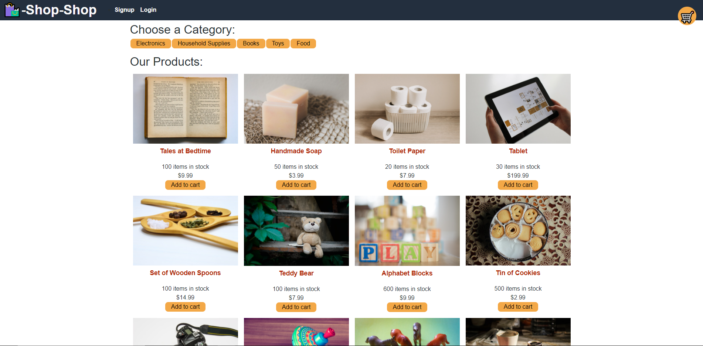

# redux-store

## Description
This is a web app that allows the user to sign up/login to purchase various items from the store. You may view your order history via the order history tab if signed in.

## Built With
* Bootstrap
* JavaScript
* Node.js
* Express.js
* React
* GraphQL
* Apollo

## Preview

## Table of Contents
* [Installation](#installation)
* [Usage](#usage)
* [License](#license)
* [Contributing](#contributing)
* [Questions](#questions)

## Installation
To install the application, follow these instructions:
Clone the [repository](https://github.com/Ahmed-Sajjad111/redux-store) to your local files, and install [Node.js](https://nodejs.org/en/)

## Usage
Open application with any command prompt interface that you prefer and type in "npm i" After all the packages are installed, simply run "npm run develop" and you will be directed to the store!

[localhost](http://localhost:3001/)

[Heroku](https://redux-store111.herokuapp.com/)

## License
This project is licensed under [MIT](https://opensource.org/licenses/MIT)

## Contributing
[Contributer Covenant Code of Conduct](https://www.contributor-covenant.org/version/2/1/code_of_conduct/)

## Questions
If you have any questions you may reach me at:

Email: uasajjad11198@outlook.com

Github: [Ahmed-Sajjad111](https://github.com/Ahmed-Sajjad111/)